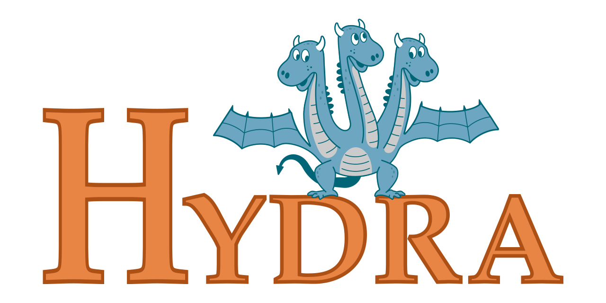
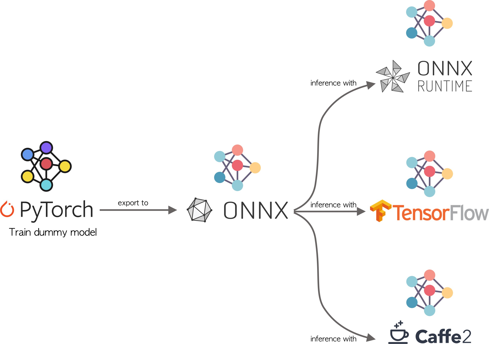
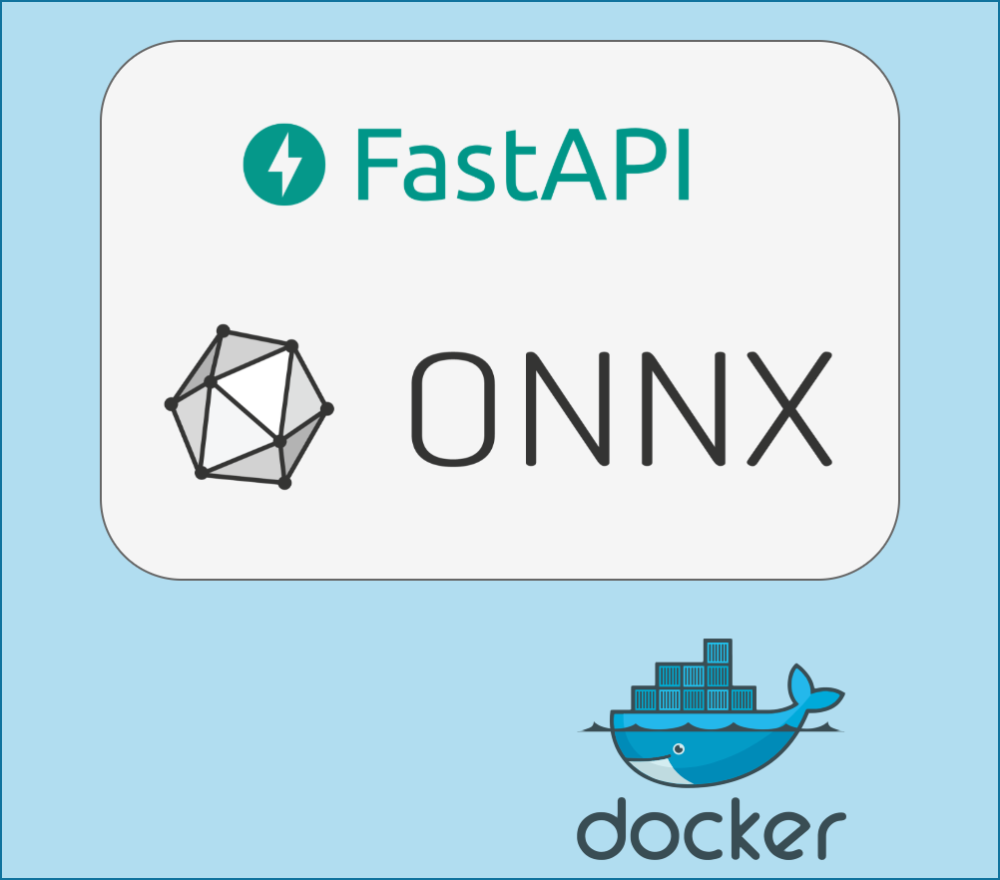

# MLOps Hands On Tutorial
MLOps, or Machine Learning Operations, is a set of practices and tools that aim to deploy and maintain machine learning models in production reliably and efficiently. It bridges the gap between data science and operations, enabling seamless integration of machine learning models into existing software systems. MLOps incorporates DevOps principles with machine learning workflows, ensuring continuous integration, continuous deployment (CI/CD), monitoring, and scalability of models.

This repository serves as a comprehensive guide to MLOps, covering the essential components such as model versioning, data management, automated pipelines, deployment strategies, and monitoring techniques. Whether you're a data scientist looking to operationalize your models or a developer wanting to integrate machine learning into your applications, this guide provides the tools and knowledge to implement effective MLOps practices.

**Note: Please raise an issue for any suggestions, corrections, and feedback.**

The goal of the series is to understand the basics of MLOps like model building, monitoring, configurations, testing, packaging, deployment, CICD, etc.

## Week 0: Project Setup and Train Model

Refer to the [Blog Post here](https://medium.com/@mzeynali01/building-a-text-classification-model-with-pytorch-lightning-a-deep-dive-7a262cb5784b)

The project I have implemented is a simple classification problem. The scope of this week is to understand the following topics:

- `How to get the data?`
- `How to process the data?`
- `How to define dataloaders?`
- `How to declare the model?`
- `How to train the model?`
- `How to do the inference?`

Following tech stack is used:

- [Huggingface Datasets](https://github.com/huggingface/datasets)
- [Huggingface Transformers](https://github.com/huggingface/transformers)
- [Pytorch Lightning](https://pytorch-lightning.readthedocs.io/)

## Week 1: Model monitoring - Weights and Biases

Refer to the [Blog Post here](https://medium.com/@mzeynali01/enhancing-your-pytorch-lightning-workflow-with-weights-biases-0e78f58ab16b)

Tracking all the experiments like tweaking hyper-parameters, trying different models to test their performance and seeing the connection between model and the input data will help in developing a better model.

The scope of this week is to understand the following topics:

- `How to configure basic logging with W&B?`
- `How to compute metrics and log them in W&B?`
- `How to add plots in W&B?`
- `How to add data samples to W&B?`

Following tech stack is used:

- [Weights and Biases](https://wandb.ai/site)
- [torchmetrics](https://torchmetrics.readthedocs.io/)

References:

- [Tutorial on Pytorch Lightning + Weights & Bias](https://www.youtube.com/watch?v=hUXQm46TAKc)

- [WandB Documentation](https://docs.wandb.ai/)

## Week 2: Configurations - Hydra

Refer to the [Blog Post here](https://medium.com/@mzeynali01/week-2-introduction-to-hydra-configuration-management-in-machine-learning-projects-32a8884f12ba)

Configuration management is a necessary for managing complex software systems. Lack of configuration management can cause serious problems with reliability, uptime, and the ability to scale a system.

The scope of this week is to understand the following topics:

- `Basics of Hydra`
- `Overridding configurations`
- `Splitting configuration across multiple files`
- `Variable Interpolation`
- `How to run model with different parameter combinations?`

Following tech stack is used:

- [Hydra](https://hydra.cc/)

References

- [Hydra Documentation](https://hydra.cc/docs/intro)

- [Simone Tutorial on Hydra](https://www.sscardapane.it/tutorials/hydra-tutorial/#executing-multiple-runs)

## Week 3: Data Version Control - DVC

Refer to the [Blog Post here](https://medium.com/@mzeynali01/week-3-how-to-use-dvc-for-machine-learning-model-management-c5b82b5dc9d0)

Classical code version control systems are not designed to handle large files, which make cloning and storing the history impractical. Which are very common in Machine Learning.

The scope of this week is to understand the following topics:

- `Basics of DVC`
- `Initialising DVC`
- `Configuring Remote Storage`
- `Saving Model to the Remote Storage`
- `Versioning the models`

Following tech stack is used:

- [DVC](https://dvc.org/)

References

- [DVC Documentation](https://dvc.org/doc)

- [DVC Tutorial on Versioning data](https://www.youtube.com/watch?v=kLKBcPonMYw)

## Week 4: Model Packaging - ONNX

Refer to the [Blog Post here](https://www.ravirajag.dev/blog/mlops-onnx)

Why do we need model packaging? Models can be built using any machine learning framework available out there (sklearn, tensorflow, pytorch, etc.). We might want to deploy models in different environments like (mobile, web, raspberry pi) or want to run in a different framework (trained in pytorch, inference in tensorflow).
A common file format to enable AI developers to use models with a variety of frameworks, tools, runtimes, and compilers will help a lot.

This is acheived by a community project `ONNX`.

The scope of this week is to understand the following topics:

- `What is ONNX?`

- `How to convert a trained model to ONNX format?`

- `What is ONNX Runtime?`

- `How to run ONNX converted model in ONNX Runtime?`

- `Comparisions`

Following tech stack is used:

- [ONNX](https://onnx.ai/)
- [ONNXRuntime](https://www.onnxruntime.ai/)

References

- [Abhishek Thakur tutorial on onnx model conversion](https://www.youtube.com/watch?v=7nutT3Aacyw)
- [Pytorch Lightning documentation on onnx conversion](https://pytorch-lightning.readthedocs.io/en/stable/common/production_inference.html)
- [Huggingface Blog on ONNXRuntime](https://medium.com/microsoftazure/accelerate-your-nlp-pipelines-using-hugging-face-transformers-and-onnx-runtime-2443578f4333)
- [Piotr Blog on onnx conversion](https://tugot17.github.io/data-science-blog/onnx/tutorial/2020/09/21/Exporting-lightning-model-to-onnx.html)

## Week 5: Model Packaging - Docker

Refer to the [Blog Post here](https://medium.com/@mzeynali01/week-5-understanding-docker-and-docker-compose-13fc15e48209)

Why do we need packaging? We might have to share our application with others, and when they try to run the application most of the time it doesn’t run due to dependencies issues / OS related issues and for that, we say (famous quote across engineers) that `It works on my laptop/system`.

So for others to run the applications they have to set up the same environment as it was run on the host side which means a lot of manual configuration and installation of components.

The solution to these limitations is a technology called Containers.

By containerizing/packaging the application, we can run the application on any cloud platform to get advantages of managed services and autoscaling and reliability, and many more.

The most prominent tool to do the packaging of application is Docker 🛳

The scope of this week is to understand the following topics:

- `FastAPI wrapper`
- `Basics of Docker`
- `Building Docker Container`
- `Docker Compose`

References

- [Analytics vidhya blog](https://www.analyticsvidhya.com/blog/2021/06/a-hands-on-guide-to-containerized-your-machine-learning-workflow-with-docker/)
